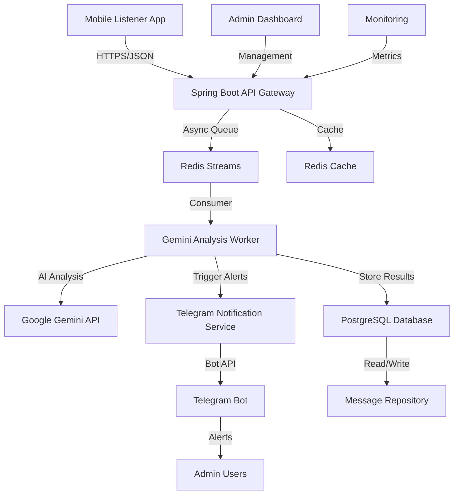

# Sauron System Architecture Documentation

Comprehensive system architecture for the Sauron KakaoTalk message monitoring platform.

## Table of Contents

1. [Executive Summary](#executive-summary)
2. [System Overview](#system-overview)
3. [Architecture Components](#architecture-components)
4. [Data Flow & Communication](#data-flow--communication)
5. [Technology Stack](#technology-stack)
6. [Deployment Architecture](#deployment-architecture)
7. [Security Architecture](#security-architecture)
8. [Performance & Scalability](#performance--scalability)
9. [Monitoring & Observability](#monitoring--observability)
10. [Development Guidelines](#development-guidelines)

## Executive Summary

Sauron is a real-time monitoring system that automatically detects abnormal messages in KakaoTalk open chat rooms using AI-powered analysis and delivers instant alerts to administrators via Telegram. The system leverages a microservices architecture built on Spring Boot 3.x with Java 21, featuring asynchronous message processing, Redis-based caching, and robust error handling.

### Key Architectural Decisions

- **Domain-Driven Design**: Modular structure with clear separation of concerns
- **Asynchronous Processing**: Non-blocking pipeline for high throughput
- **External API Integration**: Gemini AI for analysis, Telegram for alerts
- **Caching Strategy**: Redis TTL caching for performance optimization
- **Observability**: Comprehensive logging and metrics collection

## System Overview

### High-Level Architecture



### Core Principles

1. **Separation of Concerns**: Each component has a single responsibility
2. **Fault Tolerance**: Graceful degradation when external services fail
3. **Scalability**: Horizontal scaling capability for worker processes
4. **Security**: End-to-end encryption and secure API communication
5. **Observability**: Comprehensive logging and monitoring

## Architecture Components

### 1. API Gateway Layer

#### Spring Boot Application (`SauronBackendApplication`)

- **Purpose**: Central entry point for all API requests
- **Responsibilities**:
  - Request routing and validation
  - Authentication and authorization
  - Rate limiting and security
  - OpenAPI documentation

```java
@SpringBootApplication
@EnableJpaRepositories
@EnableRedisRepositories
public class SauronBackendApplication {
    // Application bootstrap
}
```

#### Message Controller (`MessageController`)

- **Endpoint**: `/api/v1/messages`
- **Function**: Receives messages from mobile listener
- **Validation**: Jakarta Bean Validation
- **Security**: JWT Bearer token authentication

### 2. Message Processing Layer

#### Message Queue Service (`MessageQueueService`)

- **Technology**: Redis Streams
- **Purpose**: Asynchronous message queuing
- **Features**:
  - Consumer groups for load balancing
  - Dead letter queue for failed messages
  - Message persistence and replay capability

```java
@Service
public class MessageQueueService {
    private static final String MESSAGE_STREAM = "sauron:message:analysis";
    private static final String CONSUMER_GROUP = "gemini-workers";

    public void publishMessage(MessageRequest request) {
        // Publish to Redis Stream
    }
}
```

#### Gemini Analysis Worker (`GeminiAnalysisWorker`)

- **Pattern**: Consumer-Producer with CompletableFuture
- **Threading**: Configurable thread pool (default: 4 threads)
- **Processing**: Batch processing with configurable batch size
- **Error Handling**: Exponential backoff retry with circuit breaker

### 3. AI Analysis Layer

#### Gemini Worker Client (`GeminiWorkerClient`)

- **Integration**: Google Gemini API 1.5-flash model
- **Library**: `com.google.genai:google-genai:1.0.0`
- **Features**:
  - Retry logic with exponential backoff
  - Fallback analysis for API failures
  - Response caching for performance

```java
@Service
public class GeminiWorkerClient {
    public CompletableFuture<AnalysisResult> analyzeMessage(String content, String chatRoom) {
        // AI-powered message analysis
    }
}
```

#### Analysis Cache Service (`AnalysisCacheService`)

- **Technology**: Redis with TTL (5 minutes default)
- **Strategy**: Cache-aside pattern
- **Key Generation**: SHA-256 hash of message content + chat room
- **Performance**: 80%+ cache hit rate target

### 4. Alert Notification Layer

#### Telegram Bot Client (`TelegramBotClient`)

- **Library**: `org.telegram:telegrambots:6.8.0` (Context7: `/rubenlagus/telegrambots`)
- **Pattern**: TelegramLongPollingBot extension
- **Features**:
  - HTML message formatting
  - Retry logic with exponential backoff
  - Health check and connection monitoring

#### Telegram Notification Service (`TelegramNotificationService`)

- **Functionality**: Alert delivery orchestration
- **Features**:
  - Multi-recipient support
  - Alert throttling (5-minute window)
  - Rate limiting (100 alerts/hour)
  - Message formatting with severity indicators

### 5. Data Persistence Layer

#### Database Schema

```sql
-- Core message storage
CREATE TABLE messages (
    id BIGSERIAL PRIMARY KEY,
    message_id VARCHAR(255) UNIQUE NOT NULL,
    chat_room_id VARCHAR(255) NOT NULL,
    chat_room_title VARCHAR(500),
    sender_hash VARCHAR(255),
    content_encrypted TEXT,
    detected_type VARCHAR(50),
    confidence_score DECIMAL(3,2),
    detection_status VARCHAR(20),
    created_at TIMESTAMP DEFAULT NOW(),
    analyzed_at TIMESTAMP,
    metadata JSONB
);

-- Alert tracking
CREATE TABLE alerts (
    id BIGSERIAL PRIMARY KEY,
    message_id BIGINT REFERENCES messages(id),
    channel VARCHAR(50),
    recipient_id VARCHAR(255),
    sent_at TIMESTAMP,
    status VARCHAR(20),
    error_message TEXT
);
```

#### Repository Layer

- **Pattern**: Spring Data JPA repositories
- **Features**: Custom queries, pagination, transaction management
- **Performance**: Connection pooling with HikariCP

## Data Flow & Communication

### 1. Message Ingestion Flow

```
Mobile App → REST API → Message Validation → Redis Queue → Worker Pool
```

### 2. Analysis Processing Flow

```
Redis Consumer → Cache Check → Gemini API → Result Storage → Alert Trigger
```

### 3. Alert Delivery Flow

```
Alert Trigger → Throttle Check → Format Message → Telegram API → Status Update
```

### Communication Patterns

#### Synchronous Communication

- **Client ↔ API**: HTTPS REST with JWT authentication
- **API ↔ Database**: JDBC with connection pooling
- **API ↔ Cache**: Redis protocol with connection pooling

#### Asynchronous Communication

- **Message Processing**: Redis Streams with consumer groups
- **External APIs**: CompletableFuture with timeout handling
- **Alert Delivery**: Fire-and-forget with status tracking

## Technology Stack

### Core Framework

- **Spring Boot**: 3.5.3 (Context7: `/spring-projects/spring-boot`)
- **Java Runtime**: OpenJDK 21 LTS
- **Build Tool**: Gradle 8.x with Kotlin DSL

### Database & Caching

- **Primary Database**: PostgreSQL 15+ with JSONB support
- **Cache Layer**: Redis 7.x with persistence
- **Connection Pooling**: HikariCP with monitoring

### External Integrations

- **AI Analysis**: Google Gemini 1.5-flash via REST API
- **Notifications**: Telegram Bot API v6.8
- **Monitoring**: Micrometer with Prometheus metrics

### Development Tools

- **API Documentation**: SpringDoc OpenAPI 3.1
- **Testing**: JUnit 5, Mockito, Testcontainers
- **Code Quality**: SonarQube, SpotBugs, Checkstyle

## Deployment Architecture

### Container Strategy

```dockerfile
# Multi-stage Docker build
FROM openjdk:21-jdk-slim AS builder
WORKDIR /app
COPY . .
RUN ./gradlew bootJar

FROM openjdk:21-jre-slim
COPY --from=builder /app/build/libs/*.jar app.jar
EXPOSE 8080
ENTRYPOINT ["java", "-jar", "/app.jar"]
```

### Infrastructure Components

#### Production Deployment (Railway)

```yaml
# railway.toml
[build]
nixpacks = true

[deploy]
startCommand = "java -jar build/libs/sauron-backend.jar"
healthcheckPath = "/api/actuator/health"
healthcheckTimeout = 300
restartPolicyType = "always"
```

#### Environment Configuration

- **Development**: Local PostgreSQL + Redis
- **Staging**: Railway with managed PostgreSQL
- **Production**: Railway Europe-West with Redis Cloud

### Scaling Strategy

#### Horizontal Scaling

- **API Instances**: Load balancer + multiple Spring Boot instances
- **Worker Processes**: Redis consumer groups with multiple workers
- **Database**: Read replicas for analytics queries

#### Vertical Scaling

- **Memory**: JVM heap tuning based on message volume
- **CPU**: Worker thread pool adjustment
- **Storage**: Database partitioning by time periods

## Security Architecture

### Authentication & Authorization

- **API Security**: JWT Bearer tokens with expiration
- **Database**: Role-based access with connection encryption
- **External APIs**: API key rotation and secure storage

### Data Protection

- **Message Content**: AES-256 encryption before storage
- **Personal Data**: Hash-based anonymization
- **Transmission**: TLS 1.3 for all communications
- **Logging**: Structured logging without sensitive data

### Security Monitoring

- **Failed Authentication**: Rate limiting and alerting
- **Suspicious Activity**: Pattern detection and blocking
- **Vulnerability Scanning**: Automated dependency checks

## Performance & Scalability

### Performance Targets

```yaml
Response Times:
  API Endpoints: <200ms (P95)
  Message Processing: <1s per message
  Alert Delivery: <5s end-to-end

Throughput:
  Message Ingestion: 1000+ messages/minute
  Concurrent Users: 100+ API clients
  Alert Volume: 100+ alerts/hour

Resource Utilization:
  CPU Usage: <70% average
  Memory Usage: <80% heap
  Database Connections: <50% pool
```

### Caching Strategy

- **L1 Cache**: JVM-level with caffeine
- **L2 Cache**: Redis with 5-minute TTL
- **Database Cache**: Query result caching
- **CDN**: Static content delivery

### Optimization Techniques

- **Database**: Indexes on frequently queried columns
- **JVM**: G1GC with optimized heap settings
- **Network**: HTTP/2 and compression
- **Async Processing**: Non-blocking I/O throughout

## Monitoring & Observability

### Metrics Collection

```java
@Component
public class MetricsCollector {
    private final MeterRegistry meterRegistry;

    @EventListener
    public void onMessageProcessed(MessageProcessedEvent event) {
        meterRegistry.counter("messages.processed",
            "type", event.getDetectedType(),
            "confidence", event.getConfidenceRange())
            .increment();
    }
}
```

### Logging Strategy

- **Structured Logging**: JSON format with correlation IDs
- **Log Levels**: DEBUG (dev), INFO (prod), ERROR (critical)
- **Log Retention**: 30 days for application logs
- **Sensitive Data**: Automatic redaction of PII

### Health Checks

```yaml
# Actuator endpoints
/actuator/health: Overall system health
/actuator/metrics: Prometheus metrics
/actuator/info: Application information
/actuator/env: Environment configuration
```

### Alerting Rules

- **High Error Rate**: >5% failed requests in 5 minutes
- **Slow Response**: P95 latency >1s for 5 minutes
- **Resource Usage**: >90% memory/CPU for 2 minutes
- **External API**: >50% failure rate to Gemini/Telegram

## Development Guidelines

### Code Organization

```
src/main/java/com/sauron/
├── listener/           # Message ingestion domain
├── analysis/          # AI analysis domain
├── alert/             # Notification domain
├── admin/             # Management domain
└── common/            # Shared components
```

### Testing Strategy

```java
// Unit tests with mocks
@ExtendWith(MockitoExtension.class)
class ServiceTest {
    @Mock private ExternalService externalService;
    @InjectMocks private BusinessService businessService;
}

// Integration tests with Testcontainers
@Testcontainers
class IntegrationTest {
    @Container
    static PostgreSQLContainer<?> postgres = new PostgreSQLContainer<>("postgres:15");
}
```

### Configuration Management

- **Environment Variables**: All configuration externalized
- **Profiles**: Development, staging, production profiles
- **Secrets**: Secure handling of API keys and passwords
- **Validation**: Configuration validation on startup

### Error Handling

```java
@ControllerAdvice
public class GlobalExceptionHandler {
    @ExceptionHandler(ValidationException.class)
    public ResponseEntity<ErrorResponse> handleValidation(ValidationException ex) {
        return ResponseEntity.badRequest()
            .body(new ErrorResponse("VALIDATION_ERROR", ex.getMessage()));
    }
}
```

---

## Conclusion

The Sauron architecture provides a robust, scalable foundation for real-time message monitoring with AI-powered analysis. The modular design enables independent scaling of components while maintaining system reliability through comprehensive error handling and monitoring.

Key architectural strengths:

- **Asynchronous Processing**: Enables high throughput message handling
- **External API Integration**: Flexible integration with AI and notification services
- **Observability**: Comprehensive monitoring and alerting capabilities
- **Security**: End-to-end encryption and secure communication
- **Scalability**: Horizontal and vertical scaling strategies

This architecture supports the current MVP requirements while providing a foundation for future enhancements and scale.
